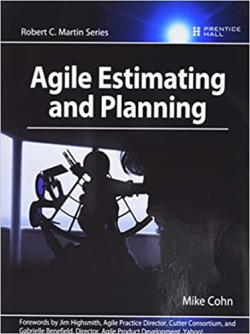

[Home](../../index.md) \ References \ [Books](list.md)

# Agile Estimating and Planning

<figure>
  
  <figcaption>Fig.1 - Agile Estimating and Planning.</figcaption>
</figure>

   <meta itemprop="bookFormat" content="EBook/DAISY3"/>
   <meta itemprop="accessibilityFeature" content="largePrint/CSSEnabled"/>
   <meta itemprop="accessibilityFeature" content="highContrast/CSSEnabled"/>
   <meta itemprop="accessibilityFeature" content="resizeText/CSSEnabled"/>
   <meta itemprop="accessibilityFeature" content="displayTransformability"/>
   <meta itemprop="accessibilityFeature" content="longDescription"/>
   <meta itemprop="accessibilityFeature" content="alternativeText"/>
   <meta itemprop="accessibilityControl" content="fullKeyboardControl"/>
   <meta itemprop="accessibilityControl" content="fullMouseControl"/>
   <meta itemprop="accessibilityHazard" content="noFlashingHazard"/>
   <meta itemprop="accessibilityHazard" content="noMotionSimulationHazard"/>
   <meta itemprop="accessibilityHazard" content="noSoundHazard"/>
   <meta itemprop="accessibilityAPI" content="ARIA"/>

   <dl>
      <dt>Title</dt>
      <dd itemprop="name">Agile Estimating and Planning</dd>
	  <dt>Autors</dt>
	  <dd itemprop="author" itemtype="https://schema.org/Person" itemscope="">Mike Cohen</dd>
      <dt>Synopsis</dt>
      <dd itemprop="description">Agile Estimating and Planning is the definitive, practical guide to estimating and planning agile projects. In this book, Agile Alliance cofounder Mike Cohn discusses the philosophy of agile estimating and planning and shows you exactly how to get the job done, with real-world examples and case studies.</dd>
      <dt>Book Size</dt>
      <dd>368 Pages</dd>
      <dt>ISBN-13</dt>
      <dd itemprop="isbn">978-0131479418</dd>
      <dt>Publisher</dt>
      <dd itemprop="publisher" itemtype="https://schema.org/Organization" itemscope="">Pearson Education</dd>
      <dt>Copyright Date</dt>
      <dd itemprop="copyrightYear">2005</dd>
      <dt>Copyrighted By</dt>
      <dd itemprop="copyrightHolder" itemtype="https://schema.org/Organization" itemscope="">Pearson Education</dd>
      <dt>Language</dt>
      <dd><meta itemprop="inLanguage" content="en-US"/>English US</dd>
      <dt>Categories</dt>
      <dd>Agile& Software Development</dd>
   </dl>

