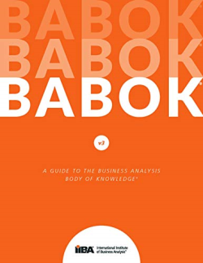

[Home](../../index.md) \ References \ [Books](list.md)

# User Stories Applied

<figure>
  
  <figcaption>Fig.1 - BABOK: A Guide to the Business Analysis Body of Knowledge.</figcaption>
</figure>

   <meta itemprop="bookFormat" content="EBook/DAISY3"/>
   <meta itemprop="accessibilityFeature" content="largePrint/CSSEnabled"/>
   <meta itemprop="accessibilityFeature" content="highContrast/CSSEnabled"/>
   <meta itemprop="accessibilityFeature" content="resizeText/CSSEnabled"/>
   <meta itemprop="accessibilityFeature" content="displayTransformability"/>
   <meta itemprop="accessibilityFeature" content="longDescription"/>
   <meta itemprop="accessibilityFeature" content="alternativeText"/>
   <meta itemprop="accessibilityControl" content="fullKeyboardControl"/>
   <meta itemprop="accessibilityControl" content="fullMouseControl"/>
   <meta itemprop="accessibilityHazard" content="noFlashingHazard"/>
   <meta itemprop="accessibilityHazard" content="noMotionSimulationHazard"/>
   <meta itemprop="accessibilityHazard" content="noSoundHazard"/>
   <meta itemprop="accessibilityAPI" content="ARIA"/>

   <dl>
      <dt>Title</dt>
      <dd itemprop="name">BABOK: A Guide to the Business Analysis Body of Knowledge</dd>
	  <dt>Autors</dt>
	  <dd itemprop="author" itemtype="https://schema.org/Organization" itemscope="">International institute of Business Analysis (IIBA)</dd>
      <dt>Synopsis</dt>
      <dd itemprop="description">A Guide to the Business Analysis Body of Knowledge (BABOK Guide) is the only globally recognized standard of practice for business analysis. Developed through a rigorous consensus-driven standards process, the BABOK Guide incorporates the collective wisdom and experience of experts in the field from around the world.</dd>
      <dt>Book Size</dt>
      <dd>783 Pages</dd>
      <dt>ISBN-13</dt>
      <dd itemprop="isbn">978-1927584026</dd>
      <dt>Publisher</dt>
      <dd itemprop="publisher" itemtype="https://schema.org/Organization" itemscope="">Lightning Source Inc.</dd>
      <dt>Copyright Date</dt>
      <dd itemprop="copyrightYear">2004</dd>
      <dt>Copyrighted By</dt>
      <dd itemprop="copyrightHolder" itemtype="https://schema.org/Organization" itemscope="">Lightning Source Inc.</dd>
      <dt>Language</dt>
      <dd><meta itemprop="inLanguage" content="en-US"/>English US</dd>
      <dt>Categories</dt>
      <dd>Business Analysis</dd>
   </dl>

