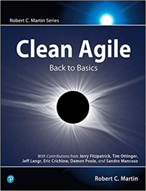

[list](list.md)

# Clean Agile

<figure>
  
  <figcaption>Fig.1 - Clean Agile: Back to Basics.</figcaption>
</figure>

   <meta itemprop="bookFormat" content="EBook/DAISY3"/>
   <meta itemprop="accessibilityFeature" content="largePrint/CSSEnabled"/>
   <meta itemprop="accessibilityFeature" content="highContrast/CSSEnabled"/>
   <meta itemprop="accessibilityFeature" content="resizeText/CSSEnabled"/>
   <meta itemprop="accessibilityFeature" content="displayTransformability"/>
   <meta itemprop="accessibilityFeature" content="longDescription"/>
   <meta itemprop="accessibilityFeature" content="alternativeText"/>
   <meta itemprop="accessibilityControl" content="fullKeyboardControl"/>
   <meta itemprop="accessibilityControl" content="fullMouseControl"/>
   <meta itemprop="accessibilityHazard" content="noFlashingHazard"/>
   <meta itemprop="accessibilityHazard" content="noMotionSimulationHazard"/>
   <meta itemprop="accessibilityHazard" content="noSoundHazard"/>
   <meta itemprop="accessibilityAPI" content="ARIA"/>

   <dl>
      <dt>Title</dt>
      <dd itemprop="name">Clean Agile: Back to Basics</dd>
	  <dt>Autors</dt>
	  <dd itemprop="author" itemtype="https://schema.org/Person" itemscope="">Robert C. Martin</dd>
      <dt>Synopsis</dt>
      <dd itemprop="description">Nearly twenty years after the Agile Manifesto was first presented, the legendary Robert C. Martin (“Uncle Bob”) reintroduces Agile values and principles for a new generation–programmers and nonprogrammers alike. Martin, author of Clean Code and other highly influential software development guides, was there at Agile’s founding. Now, in Clean Agile: Back to Basics, he strips away misunderstandings and distractions that over the years have made it harder to use Agile than was originally intended.</dd>
      <dt>Book Size</dt>
      <dd>240 Pages</dd>
      <dt>ISBN-13</dt>
      <dd itemprop="isbn">978-0135781869</dd>
      <dt>Publisher</dt>
      <dd itemprop="publisher" itemtype="https://schema.org/Organization" itemscope="">Pearson Education</dd>
      <dt>Copyright Date</dt>
      <dd itemprop="copyrightYear">2020</dd>
      <dt>Copyrighted By</dt>
      <dd itemprop="copyrightHolder" itemtype="https://schema.org/Organization" itemscope="">Pearson Education</dd>
      <dt>Language</dt>
      <dd><meta itemprop="inLanguage" content="en-US"/>English US</dd>
      <dt>Categories</dt>
      <dd>Agile& Software Development</dd>
   </dl>

