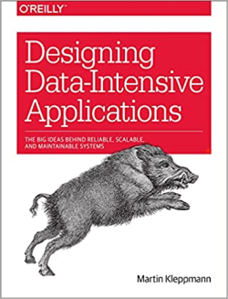

[Home](../../index.md) \ References \ [Books](list.md)

# Clean Agile

<figure>
  
  <figcaption>Fig.1 - Designing Data-Intensive Applications: The Big Ideas Behind Reliable, Scalable, and Maintenable Systems.</figcaption>
</figure>

   <meta itemprop="bookFormat" content="EBook/DAISY3"/>
   <meta itemprop="accessibilityFeature" content="largePrint/CSSEnabled"/>
   <meta itemprop="accessibilityFeature" content="highContrast/CSSEnabled"/>
   <meta itemprop="accessibilityFeature" content="resizeText/CSSEnabled"/>
   <meta itemprop="accessibilityFeature" content="displayTransformability"/>
   <meta itemprop="accessibilityFeature" content="longDescription"/>
   <meta itemprop="accessibilityFeature" content="alternativeText"/>
   <meta itemprop="accessibilityControl" content="fullKeyboardControl"/>
   <meta itemprop="accessibilityControl" content="fullMouseControl"/>
   <meta itemprop="accessibilityHazard" content="noFlashingHazard"/>
   <meta itemprop="accessibilityHazard" content="noMotionSimulationHazard"/>
   <meta itemprop="accessibilityHazard" content="noSoundHazard"/>
   <meta itemprop="accessibilityAPI" content="ARIA"/>

   <dl>
      <dt>Title</dt>
      <dd itemprop="name">Designing Data-Intensive Applications: The Big Ideas Behind Reliable, Scalable, and Maintenable Systems</dd>
	  <dt>Autors</dt>
	  <dd itemprop="author" itemtype="https://schema.org/Person" itemscope="">Martin Kleppmann</dd>
      <dt>Synopsis</dt>
      <dd itemprop="description">Data is at the center of many challenges in system design today. Difficult issues need to be figured out, such as scalability, consistency, reliability, efficiency, and maintainability. In addition, we have an overwhelming variety of tools, including relational databases, NoSQL datastores, stream or batch processors, and message brokers. What are the right choices for your application? How do you make sense of all these buzzwords?</dd>
      <dt>Book Size</dt>
      <dd>611 Pages</dd>
      <dt>ISBN-13</dt>
      <dd itemprop="isbn">978-1449373320</dd>
      <dt>Publisher</dt>
      <dd itemprop="publisher" itemtype="https://schema.org/Organization" itemscope="">O'Reilly Media</dd>
      <dt>Copyright Date</dt>
      <dd itemprop="copyrightYear">2017</dd>
      <dt>Copyrighted By</dt>
      <dd itemprop="copyrightHolder" itemtype="https://schema.org/Organization" itemscope="">O'Reilly Media</dd>
      <dt>Language</dt>
      <dd><meta itemprop="inLanguage" content="en-US"/>English US</dd>
      <dt>Categories</dt>
      <dd>System Design & Software Development</dd>
   </dl>

