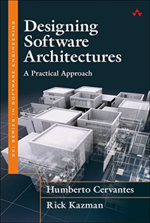

[Home](../../index.md) \ References \ [Books](list.md)

# Designing Software Architecture: A Practical Approach

<figure>
  
  <figcaption>Fig.1 - Designing Software Architecture: A Practical Approach.</figcaption>
</figure>

   <meta itemprop="bookFormat" content="EBook/DAISY3"/>
   <meta itemprop="accessibilityFeature" content="largePrint/CSSEnabled"/>
   <meta itemprop="accessibilityFeature" content="highContrast/CSSEnabled"/>
   <meta itemprop="accessibilityFeature" content="resizeText/CSSEnabled"/>
   <meta itemprop="accessibilityFeature" content="displayTransformability"/>
   <meta itemprop="accessibilityFeature" content="longDescription"/>
   <meta itemprop="accessibilityFeature" content="alternativeText"/>
   <meta itemprop="accessibilityControl" content="fullKeyboardControl"/>
   <meta itemprop="accessibilityControl" content="fullMouseControl"/>
   <meta itemprop="accessibilityHazard" content="noFlashingHazard"/>
   <meta itemprop="accessibilityHazard" content="noMotionSimulationHazard"/>
   <meta itemprop="accessibilityHazard" content="noSoundHazard"/>
   <meta itemprop="accessibilityAPI" content="ARIA"/>

   <dl>
      <dt>Title</dt>
      <dd itemprop="name">Designing Software Architecture: A Practical Approach</dd>
	  <dt>Autors</dt>
	  <dd itemprop="author" itemtype="https://schema.org/Person" itemscope="">Humberto Cervantes, and Rick Kazman </dd>
      <dt>Synopsis</dt>
      <dd itemprop="description">Designing Software Architectures will teach you how to design any software architecture in a systematic, predictable, repeatable, and cost-effective way. This book introduces a practical methodology for architecture design that any professional software engineer can use, provides structured methods supported by reusable chunks of design knowledge, and includes rich case studies that demonstrate how to use the methods.</dd>
      <dt>Book Size</dt>
      <dd>320 Pages</dd>
      <dt>ISBN-13</dt>
      <dd itemprop="isbn">978-0134390789</dd>
      <dt>Publisher</dt>
      <dd itemprop="publisher" itemtype="https://schema.org/Organization" itemscope="">Addison-Wesley Professional</dd>
      <dt>Copyright Date</dt>
      <dd itemprop="copyrightYear">2016</dd>
      <dt>Copyrighted By</dt>
      <dd itemprop="copyrightHolder" itemtype="https://schema.org/Organization" itemscope="">Addison-Wesley Professional</dd>
      <dt>Language</dt>
      <dd><meta itemprop="inLanguage" content="en-US"/>English US</dd>
      <dt>Categories</dt>
      <dd>Software Architecture</dd>
   </dl>

