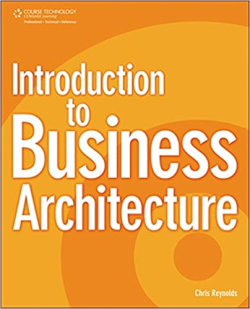

[Home](../../index.md) \ References \ [Books](list.md)

# Introduction to Business Architecture

<figure>
  
  <figcaption>Fig.1 - Introduction to Business Architecture.</figcaption>
</figure>

   <meta itemprop="bookFormat" content="EBook/DAISY3"/>
   <meta itemprop="accessibilityFeature" content="largePrint/CSSEnabled"/>
   <meta itemprop="accessibilityFeature" content="highContrast/CSSEnabled"/>
   <meta itemprop="accessibilityFeature" content="resizeText/CSSEnabled"/>
   <meta itemprop="accessibilityFeature" content="displayTransformability"/>
   <meta itemprop="accessibilityFeature" content="longDescription"/>
   <meta itemprop="accessibilityFeature" content="alternativeText"/>
   <meta itemprop="accessibilityControl" content="fullKeyboardControl"/>
   <meta itemprop="accessibilityControl" content="fullMouseControl"/>
   <meta itemprop="accessibilityHazard" content="noFlashingHazard"/>
   <meta itemprop="accessibilityHazard" content="noMotionSimulationHazard"/>
   <meta itemprop="accessibilityHazard" content="noSoundHazard"/>
   <meta itemprop="accessibilityAPI" content="ARIA"/>

   <dl>
      <dt>Title</dt>
      <dd itemprop="name">Introduction to Business Architecture</dd>
	  <dt>Autors</dt>
	  <dd itemprop="author" itemtype="https://schema.org/Person" itemscope="">Chris Reynolds</dd>
      <dt>Synopsis</dt>
      <dd itemprop="description">Business Architecture is a disciplined approach to creating and maintaining business models that enhance enterprise accountabilities and improve decision-making. Business Architecture's value proposition, unlike other disciplines, is to increase organizational effectiveness by mapping and modeling the business to the organization's business vision and strategic goals. The book is an introduction to this burgeoning new field. It explains what Business Architecture is, what a good, sustainable one should include, and explains how to implement a business architecture practically within the reader's environment. Extensive examples and case studies are included to clarify points and demonstrate clearly to the reader how they too can begin to build business architecture within their organization.</dd>
      <dt>Book Size</dt>
      <dd>249 Pages</dd>
      <dt>ISBN-13</dt>
      <dd itemprop="isbn">978-1435454224</dd>
      <dt>Publisher</dt>
      <dd itemprop="publisher" itemtype="https://schema.org/Organization" itemscope="">Course Technology PTR</dd>
      <dt>Copyright Date</dt>
      <dd itemprop="copyrightYear">2009</dd>
      <dt>Copyrighted By</dt>
      <dd itemprop="copyrightHolder" itemtype="https://schema.org/Organization" itemscope="">Course Technology PTR</dd>
      <dt>Language</dt>
      <dd><meta itemprop="inLanguage" content="en-US"/>English US</dd>
      <dt>Categories</dt>
      <dd>Business Architecture</dd>
   </dl>

