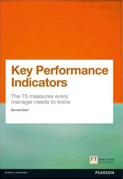

[Home](../../index.md) \ References \ [Books](list.md)

# Key Performance Indicators: The 75 Measures Every Manager Needs to Know

<figure>
  
  <figcaption>Fig.1 - Key Performance Indicators: The 75 Measures Every Manager Needs to Know.</figcaption>
</figure>

   <meta itemprop="bookFormat" content="EBook/DAISY3"/>
   <meta itemprop="accessibilityFeature" content="largePrint/CSSEnabled"/>
   <meta itemprop="accessibilityFeature" content="highContrast/CSSEnabled"/>
   <meta itemprop="accessibilityFeature" content="resizeText/CSSEnabled"/>
   <meta itemprop="accessibilityFeature" content="displayTransformability"/>
   <meta itemprop="accessibilityFeature" content="longDescription"/>
   <meta itemprop="accessibilityFeature" content="alternativeText"/>
   <meta itemprop="accessibilityControl" content="fullKeyboardControl"/>
   <meta itemprop="accessibilityControl" content="fullMouseControl"/>
   <meta itemprop="accessibilityHazard" content="noFlashingHazard"/>
   <meta itemprop="accessibilityHazard" content="noMotionSimulationHazard"/>
   <meta itemprop="accessibilityHazard" content="noSoundHazard"/>
   <meta itemprop="accessibilityAPI" content="ARIA"/>

   <dl>
      <dt>Title</dt>
      <dd itemprop="name">Key Performance Indicators: The 75 Measures Every Manager Needs to Know</dd>
	  <dt>Autors</dt>
	  <dd itemprop="author" itemtype="https://schema.org/Person" itemscope="">Bernard Marr</dd>
      <dt>Synopsis</dt>
      <dd itemprop="description">By identifying and describing the most powerful financial and non-financial KPIs, this book will make life easier for you by defining them, explaining how and when they should be used and providing a rich library of KPIs that have been proven to significantly improve performance. The book presents case examples to illustrate the selection and use of the KPIs and provides tools such as KPI selection templates and Key Performance Questions to help you apply the most appropriate KPIs effectively in your business.</dd>
      <dt>Book Size</dt>
      <dd>384 Pages</dd>
      <dt>ISBN-13</dt>
      <dd itemprop="isbn">978-0273750116</dd>
      <dt>Publisher</dt>
      <dd itemprop="publisher" itemtype="https://schema.org/Organization" itemscope="">Financial Times Press</dd>
      <dt>Copyright Date</dt>
      <dd itemprop="copyrightYear">2012</dd>
      <dt>Copyrighted By</dt>
      <dd itemprop="copyrightHolder" itemtype="https://schema.org/Organization" itemscope="">Financial Times Press</dd>
      <dt>Language</dt>
      <dd><meta itemprop="inLanguage" content="en-US"/>English US</dd>
      <dt>Categories</dt>
      <dd>Management</dd>
   </dl>

