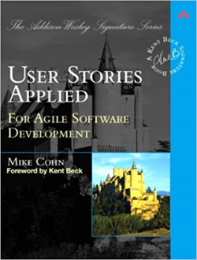

[list](list.md)

# User Stories Applied

<figure>
  
  <figcaption>Fig.1 - User Stories Applied: for Agile Software Development.</figcaption>
</figure>

   <meta itemprop="bookFormat" content="EBook/DAISY3"/>
   <meta itemprop="accessibilityFeature" content="largePrint/CSSEnabled"/>
   <meta itemprop="accessibilityFeature" content="highContrast/CSSEnabled"/>
   <meta itemprop="accessibilityFeature" content="resizeText/CSSEnabled"/>
   <meta itemprop="accessibilityFeature" content="displayTransformability"/>
   <meta itemprop="accessibilityFeature" content="longDescription"/>
   <meta itemprop="accessibilityFeature" content="alternativeText"/>
   <meta itemprop="accessibilityControl" content="fullKeyboardControl"/>
   <meta itemprop="accessibilityControl" content="fullMouseControl"/>
   <meta itemprop="accessibilityHazard" content="noFlashingHazard"/>
   <meta itemprop="accessibilityHazard" content="noMotionSimulationHazard"/>
   <meta itemprop="accessibilityHazard" content="noSoundHazard"/>
   <meta itemprop="accessibilityAPI" content="ARIA"/>

   <dl>
      <dt>Title</dt>
      <dd itemprop="name">User Stories Applied: for Agile Software Development</dd>
	  <dt>Autors</dt>
	  <dd itemprop="author" itemtype="https://schema.org/Person" itemscope="">Mike Cohn</dd>
      <dt>Synopsis</dt>
      <dd itemprop="description">Thoroughly reviewed and eagerly anticipated by the agile community, User Stories Applied offers a requirements process that saves time, eliminates rework, and leads directly to better software. A great way to build software that meets users' needs is to begin with "user stories": simple, clear, brief descriptions of functionality that will be valuable to real users. In User Stories Applied, Mike Cohn provides you with a front-to-back blueprint for writing these user stories and weaving them into your development lifecycle.</dd>
      <dt>Book Size</dt>
      <dd>304 Pages</dd>
      <dt>ISBN-13</dt>
      <dd itemprop="isbn">978-0321205681</dd>
      <dt>Publisher</dt>
      <dd itemprop="publisher" itemtype="https://schema.org/Organization" itemscope="">Addison-Wesley Professional</dd>
      <dt>Copyright Date</dt>
      <dd itemprop="copyrightYear">2004</dd>
      <dt>Copyrighted By</dt>
      <dd itemprop="copyrightHolder" itemtype="https://schema.org/Organization" itemscope="">Addison-Wesley Professional</dd>
      <dt>Language</dt>
      <dd><meta itemprop="inLanguage" content="en-US"/>English US</dd>
      <dt>Categories</dt>
      <dd>Agile& Software Development</dd>
   </dl>

